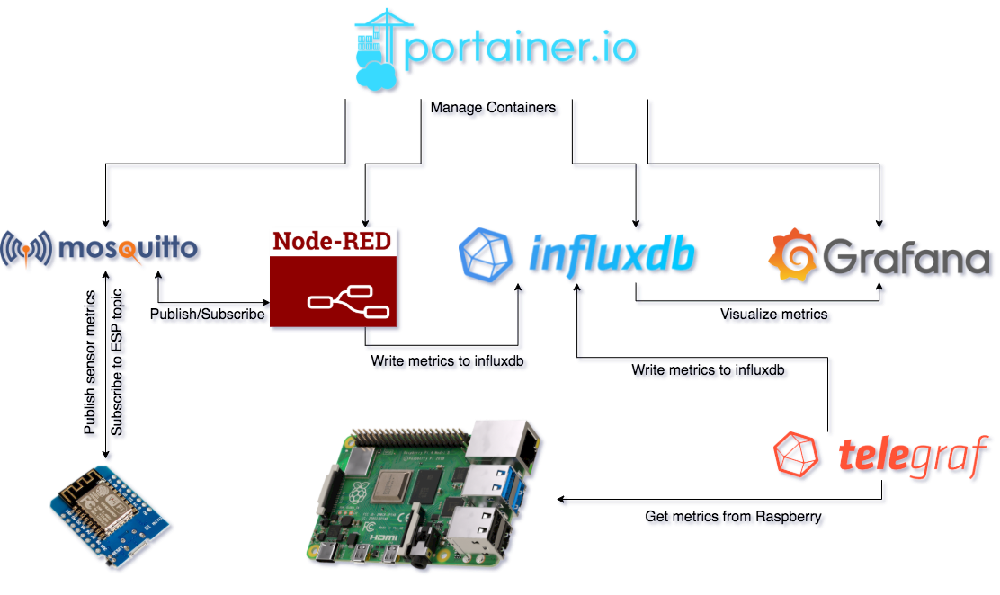

# Σύστημα Ειδοποίησης, Παρακολούθησης και Διαχείρισης Θερμοκρασίας και Υγρασίας για ένα Data Center (Work In Progress)

Ένα ενσωματωμένο σύστημα συνδεδεμένο με αισθητήρες και πρόσβαση στο διαδίκτυο για ειδοποίηση αν οι ενδείξεις από τους αισθητήρες ξεπεράσουν κάποιο προκαθορισμένο όριο. Τα δεδομένα από τους αισθητήρες θα αποθηκεύονται και οπτικοποιούνται για μελλοντική αναφορά.

**Hardware Components:**

- Raspberry Pi 4
- ESP8266 microchips
- Temperature & Humidity Sensors
- Rain-Drop Sensors
- Motion & Contact Sensors
- LEDs & Buzzers

**Software Components:**

- Raspberry Pi OS
- Database (influxdb)
- Visualization (grafana)
- MQTT Server (mosquitto)
- Orchestrator (node-red)
- Git
- Ansible
- Docker



--- 
## Α' Μέρος - Προετοιμασία του Raspberry 

Στο πρώτο μέρος υλοποίησης θα προετοιμάσουμε το raspberry ώστε να μπορέσει να υποδεχθεί το σύνολο των εφαρμογών που απαιτούνται για το project. Ξεκινάμε με την εγκατάσταση του βασικού λειτουργικού συστήματος **Raspberry Pi OS Lite**. Στη συνέχεια ενεργοποιούμε την απομακρυσμένη πρόσβαση με **SSH**. Αναβαθμίζουμε το σύνολο των πακέτων που υποστηρίζονται από το λειτουργικό και τέλος γίνεται η εγκατάσταση του **Docker** και **Docker-Compose**. 


Προαπαιτούμενα: 

- Raspberry Pi, SD card, καλώδιο ethernet και τροφοδοσία
- [Raspberry Pi OS Lite](https://www.raspberrypi.com/software/operating-systems/)
- SSH key pair ([How To Set up SSH Keys on a Linux / Unix System](https://www.cyberciti.biz/faq/how-to-set-up-ssh-keys-on-linux-unix/)) 
- Ansible ([Installation Guide](https://docs.ansible.com/ansible/latest/installation_guide/index.html#installation-guide))
- Git ([Installing Git](https://git-scm.com/book/en/v2/Getting-Started-Installing-Git))

### 1. Εγκατάσταση λειτουργικού συστήματος

Ένας τρόπος να γίνει η εγκατάσταση του λειτουργικού συστήματος είναι χρησιμοποιώντας το [Raspberry Pi Imager](https://www.raspberrypi.com/software/) που έχει γραφικό περιβάλλον ενώ ένας δεύτερος τρόπος είναι από terminal με την εντολή **dd**. Βάζουμε την SD κάρτα στον υπολογιστή μας και τρέχουμε τις παρακάτω εντολές. Με την πρώτη εντολή βλέπουμε τον αριθμό του δίσκου που έχει πάρει η κάρτα SD. Στη συνέχεια την κάνουμε unmount και με την εντολή dd γράφουμε το image στην SD κάρτα. (ΠΡΟΣΟΧΗ να δώσουμε τον σωστό αριθμό δίσκου (rdisk? or sd*) στην εντολή dd. 

MacOS
```bash
diskutil list
diskutil unmountDisk /dev/disk4
dd if=2022-01-28-raspios-bullseye-armhf-lite.img of=/dev/rdisk4 bs=1m
```

Linux
```bash
lsblk
dd if=2022-01-28-raspios-bullseye-armhf-lite.img of=/dev/sdc bs=1m
```

### 2. Ενεργοποίηση SSH

By default το ssh είναι απενεργοποιημένο στο raspberry. Το ενεργοποιούμε δημιουργώντας ένα κενό αρχείο με όνομα ssh στο root folder. Έπειτα κάνουμε unmount την SD κάρτα και την βάζουμε στο raspberry.  

```bash
touch /Volumes/boot/ssh
```

### 3. Εγκατάσταση του SSH Κey 

Αφού γίνει boot το raspberry τρέχουμε την παρακάτω εντολή. Έτσι θα μπορούμε να κάνουμε login στο raspberry χωρίς να εισάγουμε κωδικό πρόσβασης αλλά με το ιδιωτικό μας κλειδί (SSH key pair). Θα μας ζητήσει το default password που είναι το **raspberry**. Αν δεν υπάρχει local dns στην υποδομή μας αντί για raspberrypi βάζουμε την IP διεύθυνση που πήρε το raspberry. 

```bash
ssh-copy-id pi@raspberrypi
```

### 4. Ορισμός Τοποθεσίας

Κάνουμε login στο raspberry τρέχουμε την παρακάτω εντολή ορίζοντας έτσι την τοποθεσία μας ώστε να έχει το raspberry την σωστή ώρα. 

```bash
ssh pi@raspberrypi
sudo timedatectl set-timezone Europe/Athens
```

### 5. Ορισμός Τοποθεσίας

Από τον υπολογιστή μας κατεβάζουμε το project από το git και γεμίζουμε το αρχείο config.yml με μεταβλητές της επιλογής μας. 

```bash
git clone https://github.com/theohitman/pms-thesis.git
cd pms-thesis
cp config.yml.example config.yml
```

### 6. Εγκατάσταση Docker και Docker-Compose

Με το παρακάτω playbook γίνονται οι εξής ενέργειες στο raspberry:

* Απενεργοποίηση του password authentication. SSH μόνο με κλειδί (SSH key pair)
* Αναβάθμιση όλων των πακέτων του raspberry
* Εγκατάσταση απαραίτητων πακέτων για το docker
* Εγκατάσταση docker 
* Προσθήκη δικαιωμάτων στον χρήστη pi ώστε να τρέχει εντολές για το docker
* Εγκατάσταση docker-compose

```bash
ansible-playbook playbooks/docker-install.yml
```

--- 
## Β' Μέρος - Προετοιμασία του ESP8266 

Σε αυτό το μέρος θα γίνει η **διασύνδεση** των components (αισθητήρων, leds, κτλ.) με το ESP8266 καθώς και ο **προγραμματισμός** του. 

Προαπαιτούμενα: 

- ESP8266 microchips
- Καλώδιο microusb to usb
- Arduino IDE
- Αισθητήρες Humidity Sensor DHT11, Rain Sensor Module, PIR Sensor Module HC-SR501, Magnetic Reed Switch (δεν είναι απαραίτητο να έχουμε όλους τους αισθητήρες)

   

- Leds διαφορετικών χρωμάτων και buzzer

 

Στον φάκελο [sketches](https://github.com/theohitman/pms-thesis/tree/main/sketches) θα βρείτε οδηγίες για την εγκατάσταση της εφαρμογής Arduino IDE, τον κώδικα και τον τρόπο που γίνεται **upload** στο ESP8266 καθώς και σχεδιαγράμματα με την συνδεσμολογία των επιμέρους components. 

--- 
## Γ' Μέρος - Stack Deployment


### 1. Εγκατάσταση δικτύου αισθητήρων

Θα χρησιμοποιήσουμε την ασύρματη κάρτα δικτύου του raspberry για να υλοποιήσουμε ένα δίκτυο αισθητήρων. Σε αυτό το δίκτυο θα συνδέονται μόνο τα ESP microchips. 
Με το παρακάτω playbook γίνονται οι εξής ενέργειες στο raspberry:

* Εγκατάσταση πακέτων hostapd και dnsmasq
* Εκκίνηση της ασύρματης κάρτας δικτύου και ορισμός ip διεύθυνσης σε αυτή
* Ρυθμίσεις για DHCP server (dnsmasq) που θα μοιράζει ip διευθύνσεις
* Ρυθμίσεις για access point (hostapd) που θα συνδέονται τα ESP microchips

```bash
ansible-playbook playbooks/sensor-network.yml
```

### 2. Εγκατάσταση Telegraf

Με αυτό το playbook εγκαθίσταται στο raspberry το telegraf καθώς και το configuration για την βάση που θα αποθηκεύονται τα metrics κ.ά. Σκοπός του telegraf agent είναι η παρακολούθηση της υγείας του raspberry pi. 

```bash
ansible-playbook playbooks/telegraf-install.yml
```

### 3. Ανάπτυξη Stack

Με αυτό το playbook σηκώνονται όλα τα containers με τις εφαρμογές που χρειάζεται το project.

```bash
ansible-playbook playbooks/deploy-stack.yml
docker ps # Ελέγχουμε ότι είναι up τα containers
```

### 4. Τελικές ρυθμίσεις

Το stack έχει πλέον σηκωθεί και απομένουν κάποιες τελευταίες ρυθμίσεις στα επιμέρους components του project. Οι πόρτες που ακούνε οι εφαρμογές φαίνονται στο παρακάτω σχεδιάγραμμα. 

* Στο Node-RED στην καρτέλα InfluxDB επιλέγουμε ένα οποιοδήποτε InfluxDB node και ρυθμίζουμε την **database**, το **username** και **password** που ορίσαμε στο αρχείο config.yml
* Στο Node-RED στην καρτέλα Alarms θα πρέπει να ορίσουμε email που θέλουμε να έρχονται οι ειδοποιήσεις και κινητό τηλέφωνο στο twillio node αν επιθυμούμε ειδοποιήσεις μέσω sms (απαιτεί λογαριασμό στο [twillio.com](https://www.twillio.com))
* Στο Grafana πατάμε import και **Upload JSON file**. Στον φάκελο dashboards υπάρχουν τα διαθέσιμα dashboards και επιλέγουμε το **Data Center.json**.
* Τέλος αρχικοποιούμε τον κωδικό πρόσβασης για τον χρήστη admin στο **Portainer**. 

