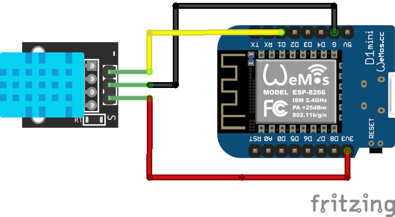
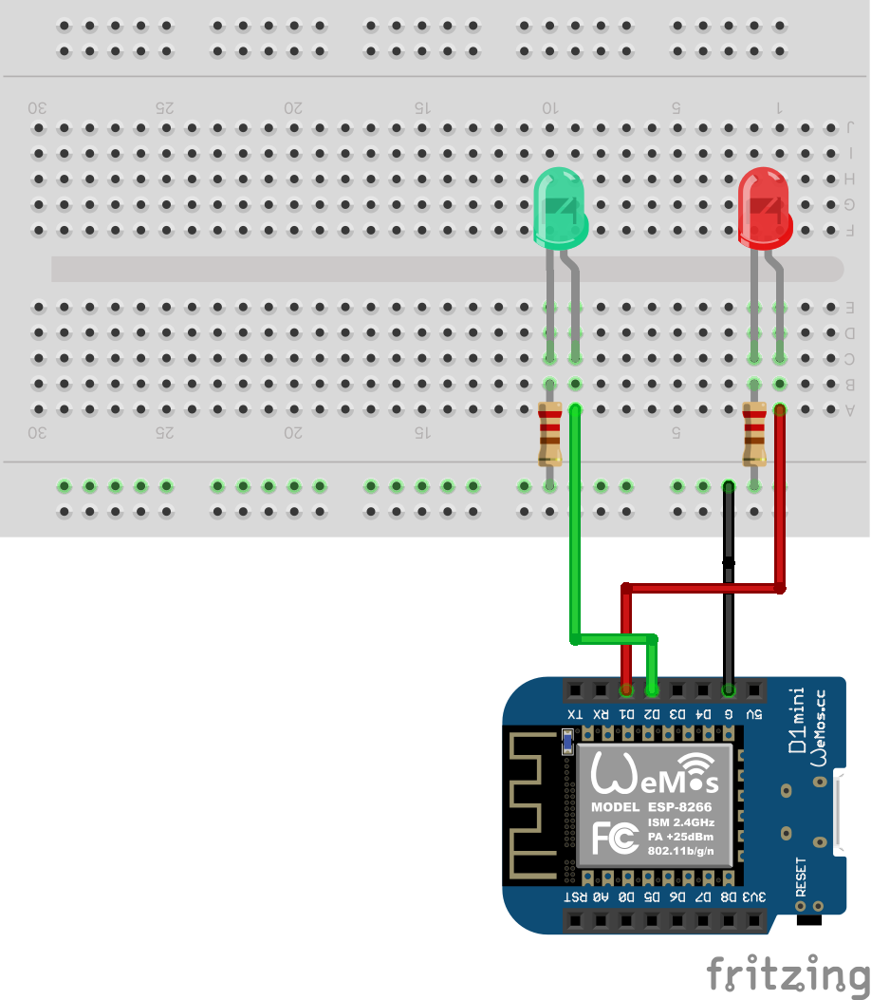
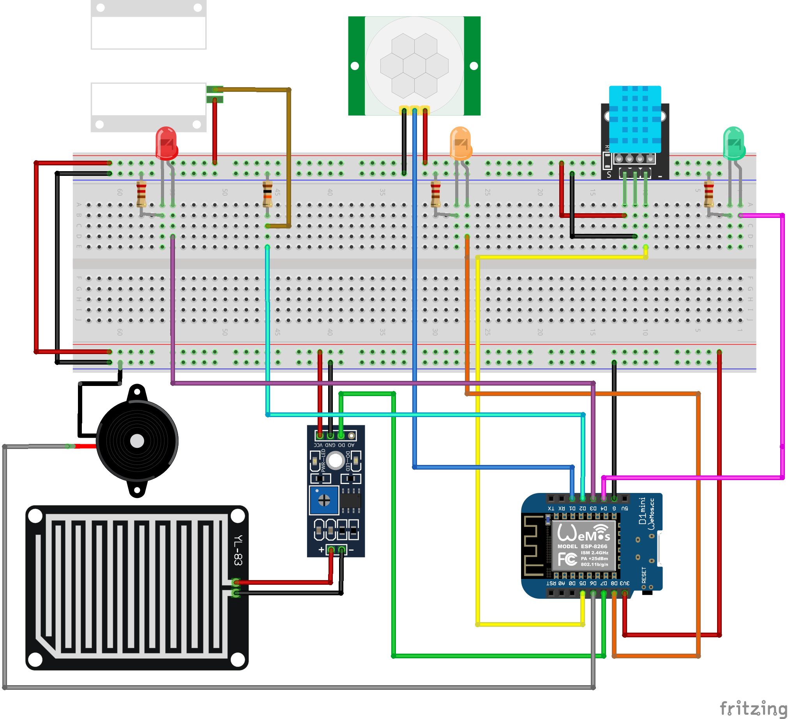

## Σε αυτό τον φάκελο αποθηκεύεται ο κώδικας (Sketches) για το ESP8266 

Με τα sketches που υπάρχουν εδώ θα μπορέσουμε να συνδέσουμε τα επιμέρους εξαρτήματα/αισθητήρες που θα χρειαστούν για το τελικό project αλλά και να κατανοήσουμε τμηματικά τον κώδικα που χρειάζεται. 

## Arduino IDE

Για να μπορέσουμε να κάνουμε upload κώδικα στο board (ESP8236) πρέπει να εγκαταστήσουμε το Arduino IDE. Γίνεται και με το Visual Studio Code προσθέτοντας το extension PlatformIO αλλά εδώ θα περιγράψω την διαδικασία με το Arduino IDE.

1. Κατεβάζουμε την εφαρμογή από το επίσημο [site](https://www.arduino.cc/en/software) για το λειτουργικό που έχουμε και την εγκαθιστούμε
2. Από τα Preferences του Arduino IDE κάνουμε paste το παρακάτω URL στο πεδίο **Additional Board Manager URLs** ώστε να μπορούμε να συνδεθούμε στο ESP8266
```bash
http://arduino.esp8266.com/stable/package_esp8266com_index.json
```
3. Από τα Tools > Board > Board Manager κάνουμε αναζήτηση το *esp8266* επιλέγοντας την τελευταία έκδοση και πατάμε **Install**
4. Αφού συνδέσουμε το board, επιλέγουμε πόρτα από τα Tools > Port > κάτι σε *usbserial* (είναι διαφορετικό σε κάθε υπολογιστή), αν δεν εμφανίζεται ίσως χρειαζόμαστε drivers (δείτε [εδώ](https://docs.wemos.cc/en/latest/ch340_driver.html))
5. Έπειτα από Tools > Board > Επιλέγουμε το board που έχουμε συνδέσει. Στην περίπτωσή μας είναι το: LOLIN(WEMOS) D1 R2 & mini 
6. Σύμφωνα με το sketch που θέλουμε να φορτώσουμε απαιτούνται και οι ανάλογες βιβλιοθήκες. Δηλώνονται συνήθως στο επάνω μέρος μετά το χαρακτηριστικό **#include**. Οι βιβλιοθήκες αυτές πρέπει να γίνουν import στο Arduino IDE. Από τα Tools > Manage Libraries... > Αναζητούμε την βιβλιοθήκη και πατάμε Install.
7. Τέλος κάνουμε copy-paste τον κώδικα που θέλουμε να φορτώσουμε,πατάμε **Verify** για να το κάνει compile και **Upload** για να το φορτώσει στο board


## Sketches

Τα προγράμματα στο Arduino λέγονται και Sketches. Η διαδικασία για να φορτώσουμε στο ESP8266 ένα από τα παρακάτω Sketches είναι η εξής:

1. Κάνουμε copy-paste τον κώδικα από το git σε ένα νέο παράθυρο στο Arduino IDE
2. Κλικ στο κουμπί **Verify** για να γίνει compile ο κώδικας και 
3. Τέλος πατάμε το κουμπί **Upload** για να φορτώσει τον κώδικα στο ESP8266 (Από Tools > Port σιγουρευόμαστε για το σωστό port που είναι συνδεδεμένο το ESP8266)

### Blink LED

Αναβοσβήνει το built in LED που βρίσκεται πάνω στο board. Το συγκεκριμμένο Sketch το χρησιμοποιούμε για να ελέγξουμε αν υπάρχει επικοινωνία με το board και μπορούμε να κάνουμε upload κώδικα.

### DHT11 Console

Δείχνει τις μετρήσεις θερμοκρασίας και υγρασίας του αισθητήρα DHT11 στην σειριακή κονσόλα του Arduino IDE. Το Sketch χρειάζεται τις βιβλιοθήκες DHT Sensor Library και Adafruit Unified Sensor της Adafruit. Για να τις προσθέσουμε πάμε από τα Tools > Manage Libraries... κάνουμε αναζήτηση και Install την τελευταία έκδοση. Η συνδεσμολογία των Pins για να δουλέψει ο κώδικας φαίνεται στο σχεδιάγραμμα.

<center></center>

Αφού κάνουμε **Verify** και **Upload** τον κώδικα για να δούμε τις μετρήσεις ανοίγουμε το **Serial Monitor** από τα Tools. 

### WiFi Station Mode

Συνδέει το ESP8266 με το ασύρματο δίκτυο του σπιτιού μας. Είναι ένα απλό Sketch που χρειάζεται όμως γιατί μας δίνει τη δυνατότητα να ελέγξουμε ότι δουλεύει το WiFi module της πλακέτας και μπορεί να συνδεθεί σε δίκτυο. Ανοίγοντας κονσόλα στο συγκεκριμμένο sketch θα δούμε τα βήματα της σύνδεσης και τέλος την IP διεύθυνση που πήρε η συσκευή μας. Η εισαγωγή βιβλιθήκης στο Arduino IDE γίνεται από τα Tools > Manage Libraries... 


### MQTT Basic

Είναι ένα απλό παράδειγμα MQTT Client σε ESP8266. Η πλακέτα αφού συνδεθεί στο WiFi στέλνει μηνύματα τύπου **hello world** σε topic με όνομα **outTopic**. Επίσης κάνει subscribe στο topic **inTopic** οπότε και είναι σε θέση να λάβει μηνύματα που θα γίνουν publish εκεί. Αν το μήνυμα που θα λάβει ξεκινάει από 1 τότε ανάβει το build in led στο ESP8266 ενώ με 0 το σβήνει. Βασική προϋπόθεση για να τρέξει αυτό το Sketch είναι να προσθέσουμε στο Arduino IDE την βιβλιοθήκη [PubSubClient](https://www.arduino.cc/reference/en/libraries/pubsubclient/) που χρησιμποιεί. Στον κώδικα αυτό που πρέπει να αλλάξουμε είναι το όνομα του δικτύου, το password και την ip που ακούει ο mqtt broker μας.

### MQTT LED

Διαχείριση LED που είναι συνδεδεμένα σε ESP8266 με MQTT. Ανάλογα με το MQTT μήνυμα που θα λάβει ο client, θα ανάψει ή θα σβήσει το αντίστοιχο LED. Στον φάκελο flows υπάρχει και το flow για διαχείριση των LEDS από το Node-Red Dashboard.   

<center></center>

### MQTT DHT11

Ένας DHT11 αιθητήρας που είναι συνδεδεμένος πάνω στο ESP8266 στέλνει τις ενδείξεις του με MQTT μηνύματα στον Broker που είναι εγκατεστημένος στο Raspberry. Στον φάκελο flows υπάρχει και το flow για την απεικόνιση των ενδείξεων στο Node-Red. 


### Magnetic Reed Switch

Διασύνδεση LED και μαγνητικού αισθητήρα στο ESP8266. Όταν εφάπτονται οι επαφές του αισθητήρα, το κύκλωμα είναι κλειστό (άρα και η πόρτα). Όταν δεν εφάπτονται οι επαφές σημαίνει ότι άνοιξε η πόρτα και δίνει εντολή να ανάψει το LED εμφανίζοντας και τα αντίστοιχα μηνύματα στην κονσόλα. 

<center></center>

### Rain Drop Sensor

Διασύνδεση LED και αισθητήρα βροχής στο ESP8266. Ο αισθητήρας αποτελείται από μια πλακέτα που όταν πέσει νερό ή την ακουμπήσουμε με κάτι αγώγιμο τότε κλείνει το κύκλωμα και αλλάζει state (HIGH, LOW). Ίδιας λογικής με τον μαγνητικό αισθητήρα, όταν αντιληφθεί νερό ανάβει το LED και εμφανίζει τα αντίστοιχα μηνύματα στην κονσόλα. 


## FINAL

Είναι το τελικό sketch που διασυνδέει όλους τους αισθητήρες, LED και buzzer με το ESP8266. Δεν είναι απαραίτητο να χρησιμοποιήσουμε όλα τα GPIO pins του microcontroller (άρα και όλους τους αισθητήρες). Απλά σχολιάζουμε τα κομμάτια κώδικα που αναφέρονται στους αισθητήρες που δεν θα συνδέσουμε. Αναλυτική περιγραφή του sketch θα γίνει στο κυρίως σώμα της εργασίας μου.

<center></center>